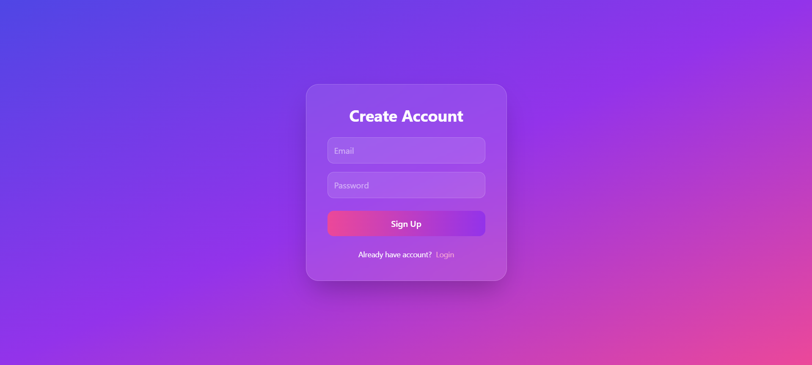
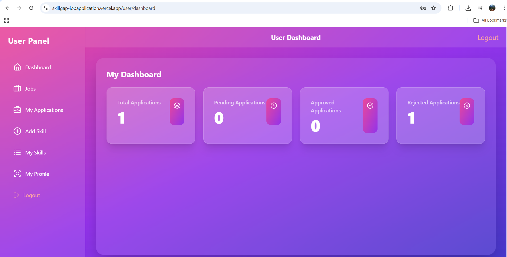
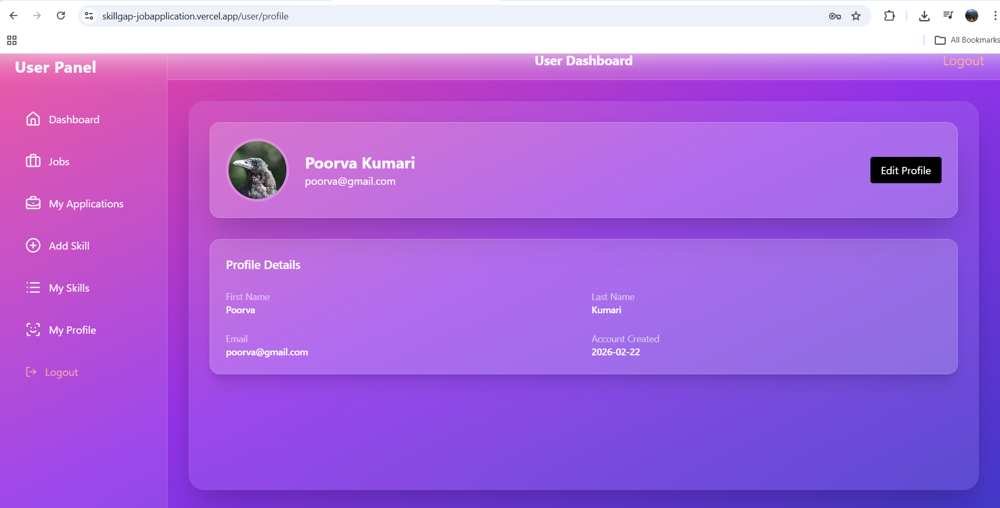
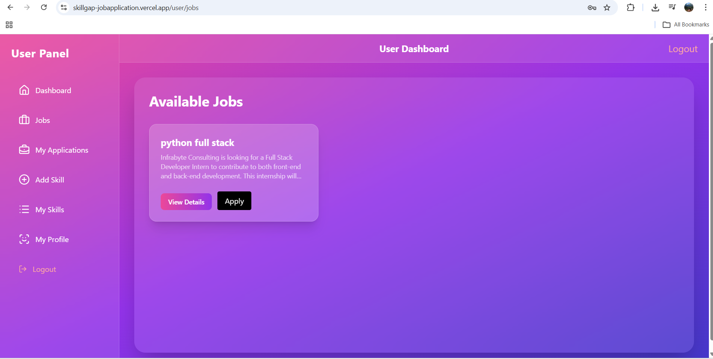
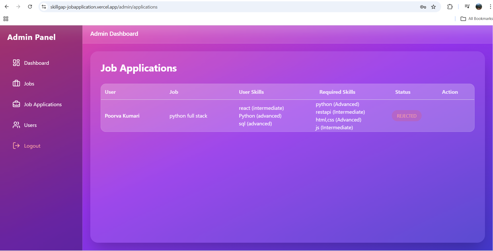
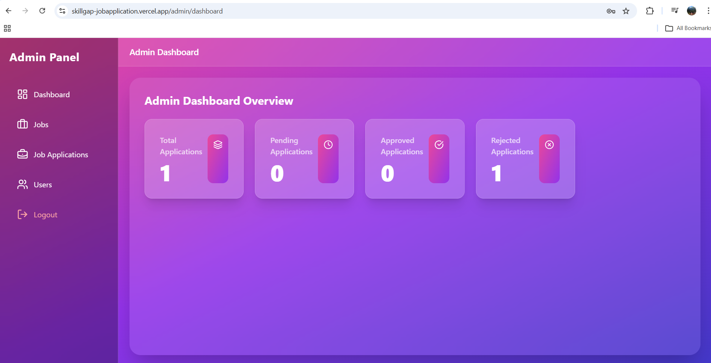
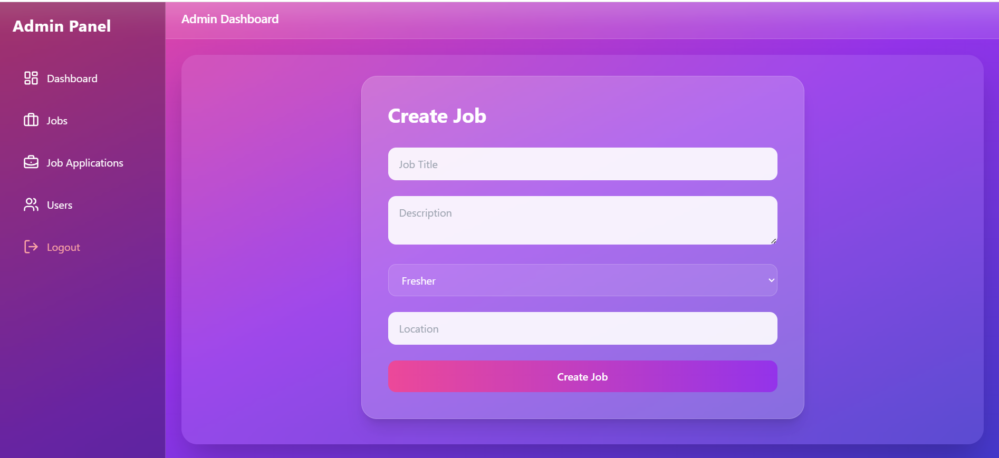
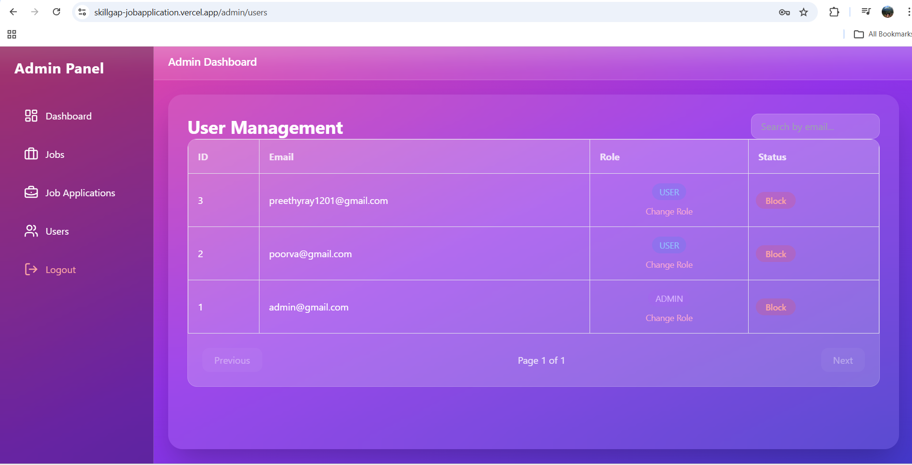
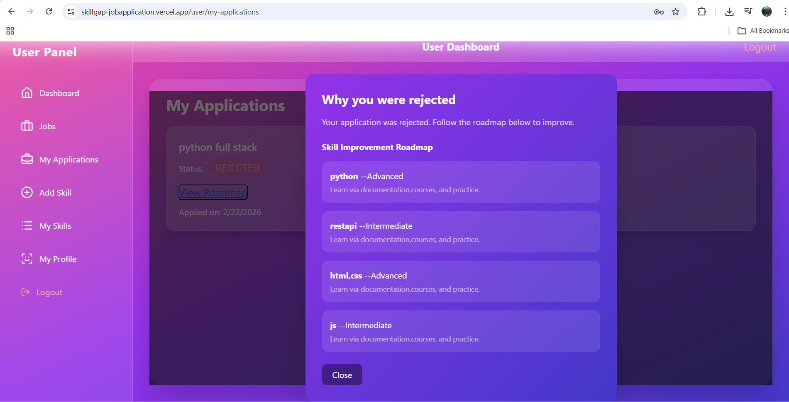

# 🚀 HireTrack

### Application & Evaluation Management System

🔗 **Live Application:** https://skillgap-jobapplication.vercel.app/
📂 **Source Code:** https://github.com/Poorvakumari/skillgap_AI

------------------------------------------------------------------------

## 📌 About The Project

HireTrack is a full-stack recruitment workflow platform designed to
simulate a real-world hiring process.

The system enables structured interaction between candidates and
administrators through secure authentication, job postings, application
tracking, and evaluation workflows.

It demonstrates end-to-end full-stack integration using modern web
technologies and RESTful architecture.

------------------------------------------------------------------------

## 🎯 Core Objectives

-   Provide a centralized platform for job applications
-   Enable administrators to evaluate candidates efficiently
-   Implement structured feedback mechanisms
-   Demonstrate role-based authentication and protected routes
-   Showcase full-stack system design and API integration

------------------------------------------------------------------------

## ✨ Key Features

### 👤 Candidate Module

-   Secure user registration and login (JWT-based authentication)
-   Profile and skill management
-   Browse available job postings
-   Apply for jobs
-   Track application status
-   View evaluation feedback

### 🛠 Administrator Module

-   Admin dashboard with system overview
-   Create and manage job postings
-   Monitor users and applications
-   Accept or reject applications
-   Provide structured feedback to candidates

------------------------------------------------------------------------

## 📸 Screenshots

### 🔐 Signup / Login Page

---

### 👤 User Dashboard

---

### 🧾 User Profile

---

### 💼 Jobs Available

---

### 📝 Job Application

---

### 🛠 Admin Dashboard

---

### ➕ Job Creation (Admin)

---

### 👥 List of Users (Admin)

---

### 🗺 Roadmap / Feedback View

------------------------------------------------------------------------

## 🏗 System Architecture

React Frontend (Vercel)\
↓\
RESTful API Communication\
↓\
Django Backend (Render)\
↓\
MySQL Database

------------------------------------------------------------------------

## 🧰 Technology Stack

### Backend

-   Django
-   Django REST Framework
-   JWT Authentication
-   MySQL

### Frontend

-   React.js
-   Axios

### UI & Styling

-   Tailwind CSS
-   Bootstrap

### Deployment

-   Backend hosted on Render
-   Frontend hosted on Vercel
-   Backend hosted on Render (free tier – may experience cold start delay)

------------------------------------------------------------------------

## 🔐 Security Implementation

-   Token-based authentication using JWT
-   Role-based access control (User/Admin)
-   Protected API endpoints
-   Secure environment configuration

------------------------------------------------------------------------

## ⚙️ Local Development Setup

### Clone Repository

git clone https://github.com/Poorvakumari/skillgap_AI.git\
cd skillgap_AI

### Backend Setup

cd backend\
pip install -r requirements.txt\
python manage.py migrate\
python manage.py runserver

Backend runs at: http://127.0.0.1:8000

### Frontend Setup

cd frontend\
npm install\
npm start

Frontend runs at: http://localhost:3000

------------------------------------------------------------------------

## 🔄 Application Workflow

1.  User registers and logs in.
2.  JWT token is generated for secure authentication.
3.  User updates profile and adds skills.
4.  Admin creates job postings.
5.  Users apply for jobs.
6.  Admin evaluates applications.
7.  Application status and feedback are reflected in the user dashboard.

------------------------------------------------------------------------

## 📊 Database Design

-   Users
-   Skills
-   Jobs
-   Job Applications
-   Role-based permissions
-   Foreign key relationships ensuring data integrity

------------------------------------------------------------------------

## 📱 Responsive Design

The UI is optimized for desktop, tablet, and mobile devices using
Tailwind CSS and Bootstrap.

------------------------------------------------------------------------

## 🧠 Technical Highlights

-   RESTful API architecture
-   Role-based authentication and authorization
-   Full-stack integration (React + Django)
-   Structured recruitment workflow implementation
-   Optimized database queries for performance
-   Deployment across cloud platforms

------------------------------------------------------------------------

## 🚀 Future Enhancements

-   Email notifications for application updates
-   Resume upload functionality
-   Admin analytics dashboard
-   Advanced job filtering and pagination
-   Interview scheduling module

------------------------------------------------------------------------

## 👩‍💻 Author

**Poorva Kumari**\
📧 poorvakumari12@gmail.com\
🔗 https://linkedin.com/in/poorva-kumari-17286122a\
🐙 https://github.com/Poorvakumari

------------------------------------------------------------------------

## 📄 License

This project is licensed under the MIT License.
